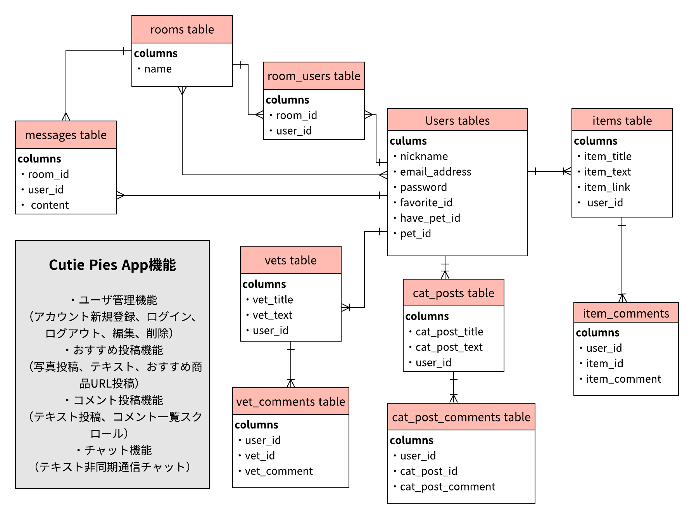

# README FOR CUTIE PIES

## Overview
* "可愛い家族と生涯幸せに"をコンセプトに、ペットと暮らしている人もそうでない人も楽しめるWebサイトを作成しました。
写真の投稿やコメント機能、チャットルームでの雑談やおすすめの商品や動物病院などペットに関する様々な情報交換の場としても利用が可能です。

* CUTIE PIES to share your pets pictures and recommendation of items, foods, vets etc..and also can ask your pets' problems to live healthy and be happy together. 

## Description
* Webサイトの使用には、ユーザ登録が必要です。ニックネーム、Eメールアドレス、パスワードの他にペットの有無や名前なども登録が可能です。ユーザ情報の変更にはヘッダーから「アカウントの編集」をクリックし、必要に応じてアカウントの情報を変更してください。その際にパスワードの入力は確認用も含めて再入力して頂く必要があります。
アカウントの削除も可能ですが、削除後操作を取り消すことができないので、必要の場合は再度アカウントの登録をしてください。
* 投稿された写真やおすすめに対してコメントを残すことが可能で、最新のコメントがコメント欄最上位に表示されます。
* おすすめ投稿にはタイトルやアイテムの説明文の他にAmazonページのURL投稿が可能で、クリックするとページ遷移が簡単にできるようになっています。
* 過去に投稿した写真やおすすめはマイページから閲覧が可能です。マイページにはヘッダーのニックネームまたは過去に投稿した写真ページ内ニックネームからページ遷移ができ、他ユーザのマイページも簡単に閲覧することが可能です。

* Need to make your own account to use CUTIE PIES, just put your nickname( the other user can see your nickname), email address, password and your pet info as well if you have a pet.
Then, share your pictures or just look around other cats or dog or talk to someone about your problems or life style whatever you feel like.
Just click your nickname on the header when you want to change your account information, also can delete your account on the page but you can not undo after delete it, please make your account again if you want it again.
* You can add your comments when you want to talk to the poster and the newest comment is on the top of the list.
* Share your recommendation of items for your pets and add Amazon URL if they have it to check the item easily but it's not necessary.
* You can check your pictures and recommendation that you posted from your account page which called "My Page". Transition to My Page from your nickname on the header or posted you did before and also you can check the other user's My Page.

### - Development environment -
* ruby 2.6.5
* Rails 6.0.3.2
* AWS S3
* MySQL
* JavaScript
* jQuery
* HTML
* CSS

### - Deployed URL -
* https://cutie-pies.herokuapp.com/
* test account : ID / koneko , password / koneko123

### - ER図 -

## users table

| Column                | Type    | Options     |
| --------------------- | ------- | ----------- |
| nickname              | string  | null: false |
| favorite_id           | integer | null: false |
| have_pet_id           | integer | null: false |
| email                 | string  | null: false |
| password              | string  | null: false |

### Association
has_many :cat_posts
has_many :cat_post_comments
has_many :dog_posts
has_many :dog_post_comments
has_many :vets
has_many :vet_comments
has_many :items
has_many :items_comments
has_many :chats
has_many :chat_comments

## cat_posts table

| Column               | Type       | Options                        |
| -------------------- | ---------- | ------------------------------ |
| user_id              | references | null: false, foreign_key: true |
| cat_post_title       | string     | null: false                    |
| cat_post_text        | text       | null: false                    |

### Association
belongs_to :user
has_many   :cat_post_comments

## cat_post_comments table
| Column           | Type       | Options                            |
| ---------------- | ---------- | ---------------------------------- |
| user_id          | references | null: false, foreign_key: true     |
| cat_post_id      | references | null: false, foreign_key: true     |
| cat_post_comment | text       | default: "", null: false           |

belongs_to :user
belongs_to :cat_post

## dog_posts table

| Column               | Type       | Options                        |
| -------------------- | ---------- | ------------------------------ |
| user_id              | references | null: false, foreign_key: true |
| dog_post_title       | string     | null: false                    |
| dog_post_text        | text       | null: false                    |

### Association
belongs_to :user
has_many   :dog_post_comments

## cat_post_comments table
| Column           | Type       | Options                            |
| ---------------- | ---------- | ---------------------------------- |
| user_id          | references | null: false, foreign_key: true     |
| dog_post_id      | references | null: false, foreign_key: true     |
| dog_post_comment | text       | default: "", null: false           |

belongs_to :user
belongs_to :dog_post

## items table

| Column           | Type       | Options                        |
| ---------------- | ---------- | ------------------------------ |
| user_id          | references | null: false, foreign_key: true |
| items_title      | string     | default: "", null: false       |
| items_text       | text       | default: "", null: false       |
| items_link       | text       |                                |

### Association
belongs_to :user
has_many   :items_comments

## items_comments table

| Column           | Type       | Options                        |
| ---------------- | ---------- | ------------------------------ |
| user_id          | references | null: false, foreign_key: true |
| item_id          | references | null: false, foreign_key: true |
| items_comment    | text       | default: "", null: false       |

### Association
belongs_to :user
belongs_to :items

## vets table

| Column           | Type       | Options                        |
| ---------------- | ---------- | ------------------------------ |
| user_id          | references | null: false, foreign_key: true |
| vet_title        | string     | default: "", null: false       |
| vet_text         | text       | default: "", null: false       |

### Association
belongs_to :user
has_many   :vet_comments

## vets_comments table

| Column           | Type       | Options                        |
| ---------------- | ---------- | ------------------------------ |
| user_id          | references | null: false, foreign_key: true |
| vet_id           | references | null: false, foreign_key: true |
| vet_comment      | text       | default: "", null: false       |

### Association
belongs_to :user
belongs_to :vet

## chats table

| Column           | Type       | Options                        |
| ---------------- | ---------- | ------------------------------ |
| user_id          | references | null: false, foreign_key: true |
| room_name        | string     | null: false                    |
| chat_text        | text       | default: "", null: false       |

### Association
belongs_to :user
has_many :chat_comments

## chat_comment table

| Column           | Type       | Options                        |
| ---------------- | ---------- | ------------------------------ |
| user_id          | references | null: false, foreign_key: true |
| chat_id          | references | null: false, foreign_key: true |
| chat_comment     | text       | default: "", null: false       |

### Association
belongs_to :user
belongs_to :chat

## Background of this web application 
* 日本ではまだペットを飼える場所か少なく、ペットと暮らす事そのものが難しいというのが現状です。その為、動物病院やフードのオススメなどの情報も埋もれやすく、誰かに直接相談ができません。そんな中、大切な家族であるペットとより良い暮らしをするにはどうしたらいいのかと考えた時に、このWebサイトの構築を考えました。
大切な家族とより幸せに過ごすために、情報は欠かせません。人間にもたくさんの性格や体質があるように猫や犬も十人十色、千差万別です。自身が経験した事や知っている情報を共有、発信することで動物たちと幸せに暮らせる家族が増えればと考えています。

* Having a pet in Japan is really hard because lots of places aren't allowed pet and people have never had a pet so, don’t know how to have them and care of them at the first time and there is no place to talk or ask about it. But I'm convinced you and your cuties could be happier if you know great items or foods or vet, etc... because no one same personality and constitution to the other people, the same is true of animals too.
And I’ve been thinking that would be great if I make the place for people who love animals and want to share the opinions and recommendation to make the other people’s happy.

## Author
Ayumi Uchimura
